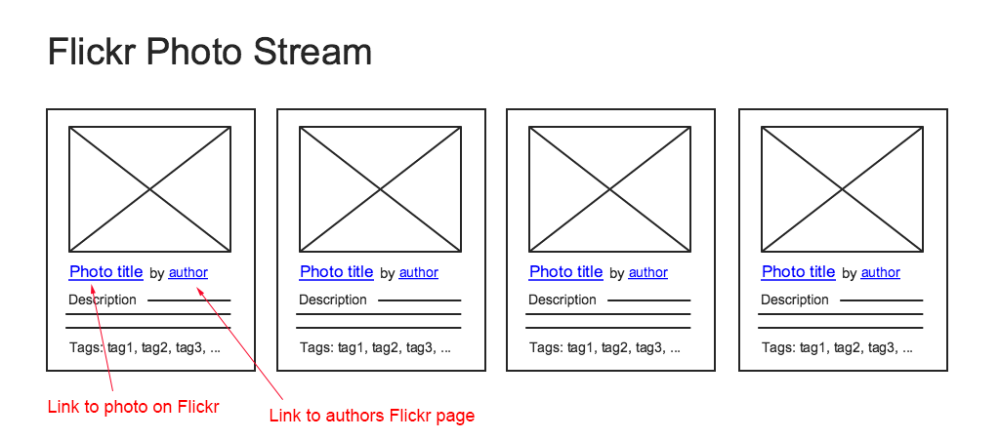

## Web Development Flickr Task

##### Your task is to consume the public [Flickr API](https://api.flickr.com/services/feeds/photos_public.gne?format=json) and display the results according to this basic wireframe:

> 

We would expect this task to take a few hours, however there is no strict time limit and you won't be judged on how long it took you to complete. Please find a few pointers below:

* The website you create should function as a [single page app](http://en.wikipedia.org/wiki/Single-page_application).
* You must use HTML and CSS (using pre-compilers such as Sass or LESS is fine).
* Your app should support the major browsers (Chrome, Firefox, Safari, IE10+).
* We would encourage that you use a framework to speed up development time.
* If you do decide to use other Flickr API feeds to show us what you can do, be aware that some endpoints do require an API key. You can apply for your own [here](https://www.flickr.com/services/api/keys).

Although the main outcomes of the task are listed above, if you feel like you want to go that extra mile and show us what you're capable of, here is a list of potential enhancements that we have come up with:

* Think about how you might improve the speed of the page in terms of the images/content loading.
* Allow the page to have an infinite scroll (loading in more images as you scroll).
* A search functionality based on tags, or possibly the title of the photo.
* Alternatively if you can think of any other features that you feel would further enhance your app, then we'd love to see what you can come up with!
