# Testing Overview

## Brief view of Housekeeping checks
Describe what housekeeping checks are, and when and why we do them. [Housekeeping doc here](https://docs.google.com/spreadsheets/d/1fqX4IfXZ_ohAzI8RE6hcUBNj4XJVg14DSStRHvWqAEA/edit)
Test coverage across various devices/browsers, we use our browser stats and the housekeeping spreadsheet to see recently used devices/browsers. [Browser stats here](https://docs.google.com/spreadsheets/d/1CLWs1LTmzLdAx77wJzJWmDkF1iqUuJjZ9sfiEqq8TfI/edit#gid=847406362) 

We use a variety of different platforms, these are as follows:
* TripApp
* Render
* HXML
* Hapi
Depending on how customers approach our sites, will depend on what platform they will land on.

## Testing Environments:
### Trip app deployment/testing procedure
How to test on the Trip app
We set our TripController to the correct environment. This depends on the platform we are working on and also the tester.

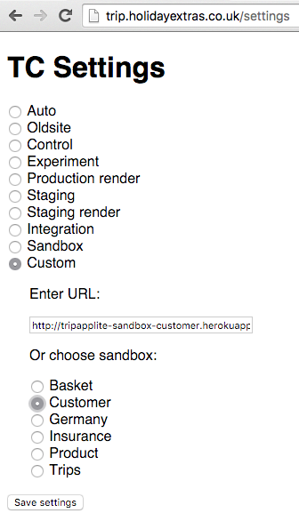

We have several environments when using TripApp:
* Local
* Sandbox
* Staging
* Production/Live
TripApp site example https://www.holidayextras.co.uk 
Worth noting Germany is on TripApp with most core products. (Keep that in mind)
The diagram below explains how long we spend testing in each environment through to Production.

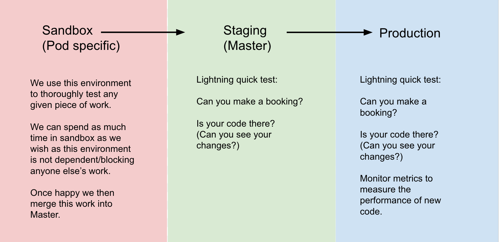

### HXML deployment/testing procedure
How to test on HXML
We use Junos pulse or change our DNS connection to the correct environment.

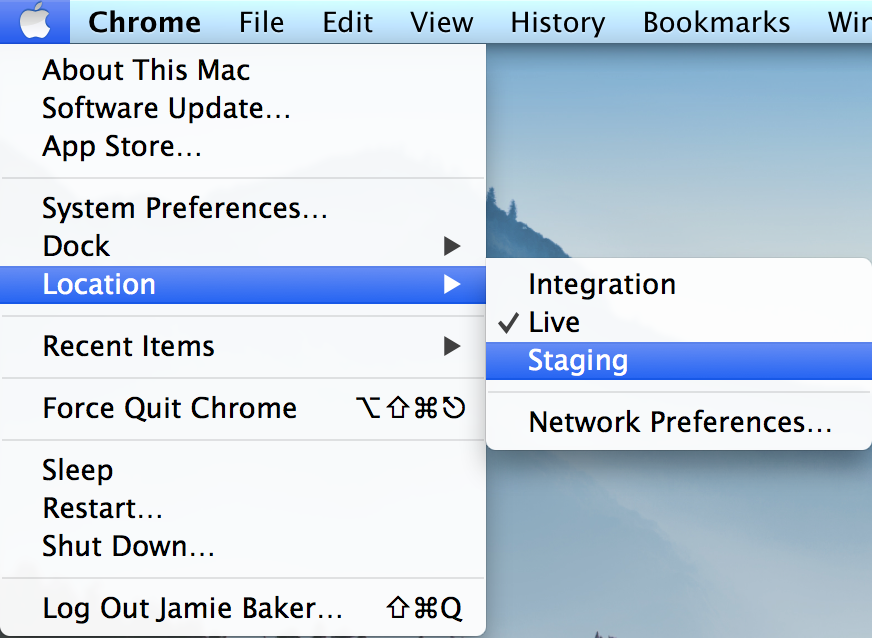

We have four environments when using HXML:
* Local
* Integration
* Staging
* Production

There’s also occasions where we can hit the right environment by adding to the url we’re using like so - “.hxint” after “.co.uk” “www.holidayextras.co.uk.hxint/” to test in integration, this means DNS will not be needed.
When testing SEO (Landing page) changes, the first environment that is tested is called “.SEO”. Normally entered in the URL, this will have no traffic going to it and can be tested like a normal landing page.
Medical Insurance for example is on HXML.

The diagram below explains how long we spend testing in each environment through to Production.

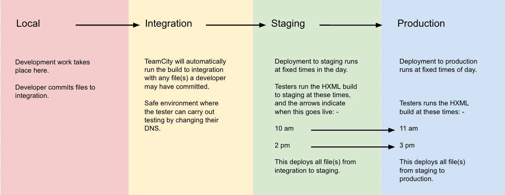

HX Admin (bits) - Work done on HXML can be wrapped in something called a “bit”. This means we can easily turn this bit of code on or off in any given environment. As Testers, this allows us the flexibility and control when testing specific work that is wrapped in a bit.

### Render deployment/testing procedure
How to test on Render
We use Junos pulse or change our DNS connection to the correct environment i.e Integration, Staging.

Example Render site - https://www.airparks.co.uk 
We have three environments when using Render:
* Local
* Staging
* Production
The diagram below explains how long we spend testing in each environment through to Production.

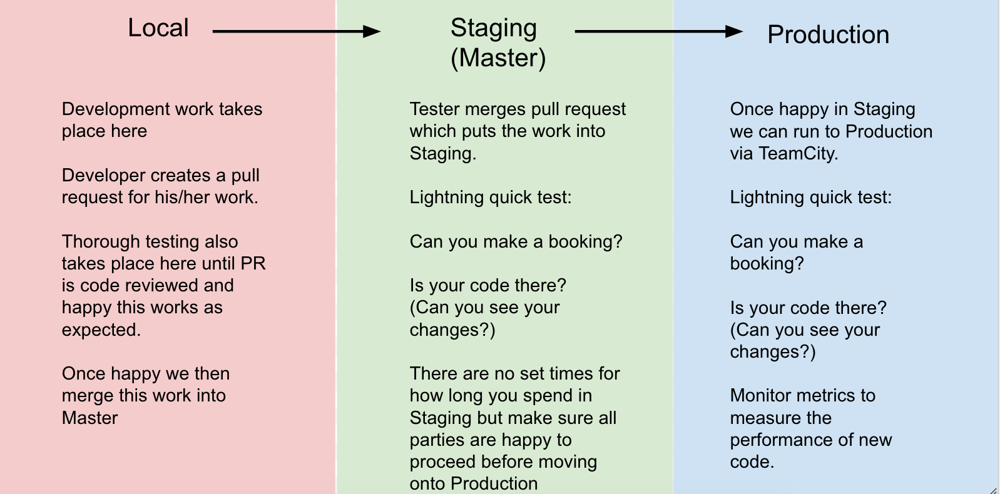

### HAPI deployment/testing procedure
How to test HAPI
It is best to test HAPI locally along with TripApp or Render as these work together when a Hapi change is made, in some instances.
We have three environments when using Hapi:
* Local
* Staging
* Production

The diagram below explains how long we spend testing in each environment through to Production.

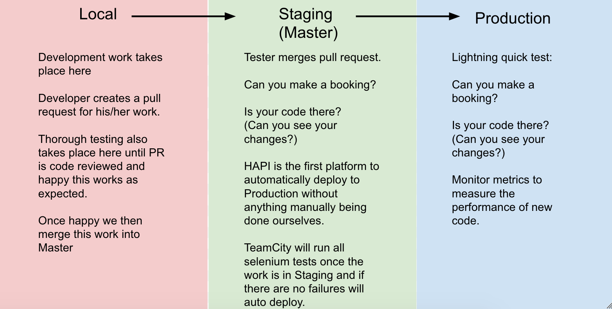

## How we test:
### What do we test?
Each pod has it’s own tester, sometimes two. Each pod has it’s own focus which means the testers work has a particular scope.
As testers, we need to be flexible and have a wide business knowledge. This is partially achieved with the Testing Kanban which has work that pods cannot cover in their own sprint. However, it is predominantly there for pods that do not have their own tester. 
Each tester has a day per sprint spent on the Kanban board. [Board here](https://holidayextras.jira.com/secure/RapidBoard.jspa?rapidView=281&view=detail&selectedIssue=EMA-2280)
We also put ourselves in the customer’s shoes, try and think like a customer, what would they do when using a particular feature, is there anything we can improve etc. Therefore, we can be suggestive in the design phase as well as the testing phase.

### How do we feedback?
When work is “Test Ready” the developer should be available to work on any feedback given by us. However, this is not always the case due to time constraints but will always be available to address any feedback given.
A Tester and Developer should be communicating at all times throughout testing and this can be over a variety of different mediums: Verbally, Jira, Github PR’s and Slack.
Although communication is encouraged through the above mediums, we should always document our testing coverage on Jira which keeps anyone involved in the work, up-to-date.
When we report findings on work we’re testing, these should generally fall into the category of “Testing bug” and an “Improvement. Testing bugs should be raised as sub tasks on the Jira for a Dev to then work on. An improvement is a suggestion or something that is not broken as such and can be included in our testing notes.

### What do we check for?
Testing requirements differ from a simple as a one line change requiring a very small check to a [whole test](https://docs.google.com/spreadsheets/d/1GyTQlfkb89KBDrpB_mNhjqY0eB68dvQ3BXXek3hqEiA/edit#gid=1041605717) plan needed for a big feature.
We can test for the following:
* Functionality
* Visual changes
* Accessibility
* Data/Tracking
* Split tests
The list goes on….

### What do we use when testing?
There’s a number of tools available to us that we can use when testing. These enable us to check certain aspects with ease, here’s a list of some:

* EditThisCookie - This is a cookie manager. You can add, delete, edit, search, protect and block cookies. This enables us to check for things like a split test and force this to show us the alternative. Checking for a cookie is incredibly simple.

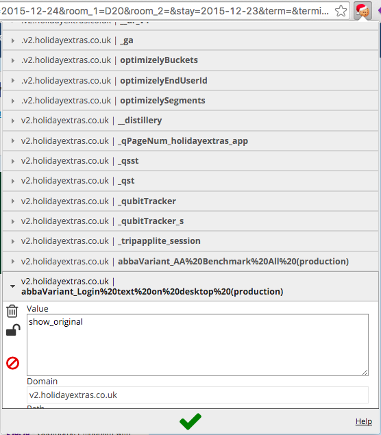

* TinyGrab or CloudUp - These are simply screenshot based but provide us a link to the screenshot which we can use in our testing notes.

* VirtualBox - This allows us to test Internet Explorer browsers from IE7 all the way up to the latest version on a number of different Windows Operating Systems.

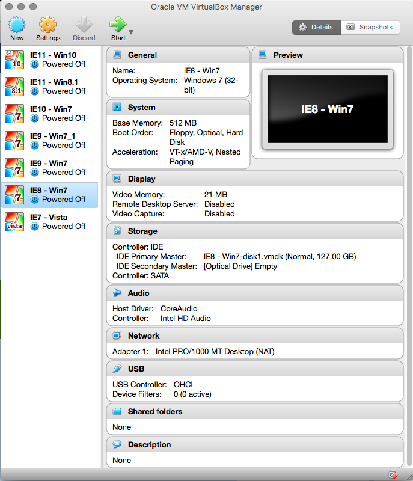

* Gas Mask - This is a simple host file manager. It allows us to edit host files and switch between them meaning we can switch domains and test locally on our machine.

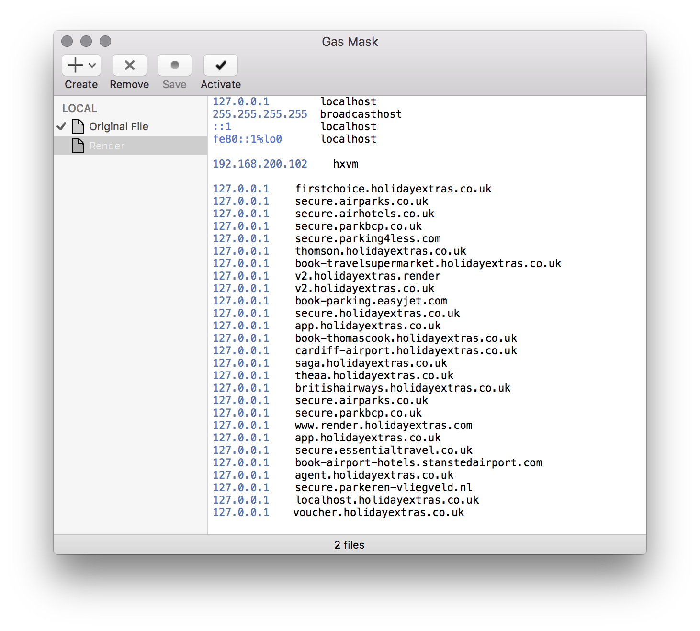

* GhostLab - This enables us to control multiple devices and check multiple browsers at the same time, enabling us to do a side by side comparison.

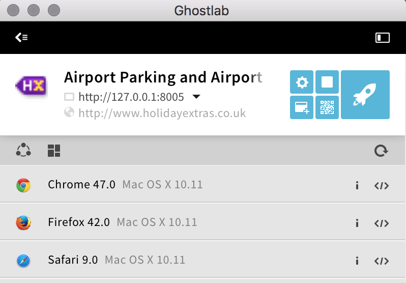

* RecordIt - This enables us to record our screen and input this into our testing notes or make it into a gif.

* Screenhero - This enables us to screen share with others which is great when working in different areas, especially when working from home. This also aids towards pair testing, which can be beneficial depending on the work.

* Devices - We have a whole cupboard full of different devices that we can test on as we need to make sure our coverage over a variety of mobile platforms is covered. We have a device manager where we can see who has what device currently found [here](http://hx-device-manager.herokuapp.com/).

* HX Admin - HX Admin is used for a number of things around the business but generally as Testers we use it for controlling bits as mentioned earlier in the overview and sometimes checking agent code setup.

* HXCM (Content Manager) - This is a tool that can be used when the content for a product changes.

* HX Track - We use this to mainly to check tracking is present for any given scenario we wish. This can also be used to follow a customer’s path which can lead us to pain points for us to look into.

* Github - This is used for all our platforms excluding HXML. Pull requests are created here for any work that has been done on any given platform and can be reviewed. As Testers this is where we merge a PR that is fully reviewed and ready for Staging. You can find any platform repository [here](https://github.com/holidayextras).

* TeamCity - As mentioned in the deployments section this is where we can see the deployment pipelines and where are work is through the environments. Here we can also see when a deployment has failed and look into reason why this happened.

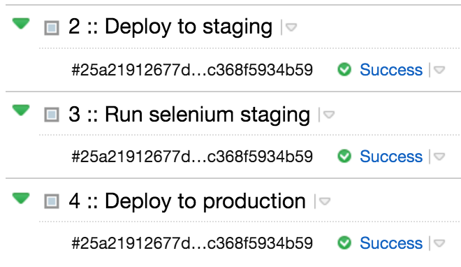